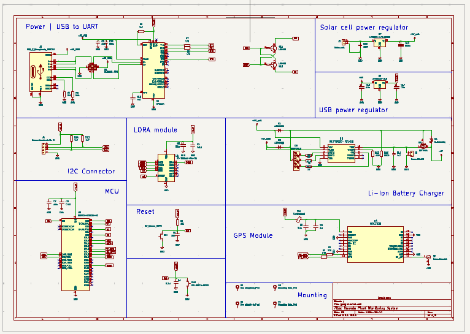
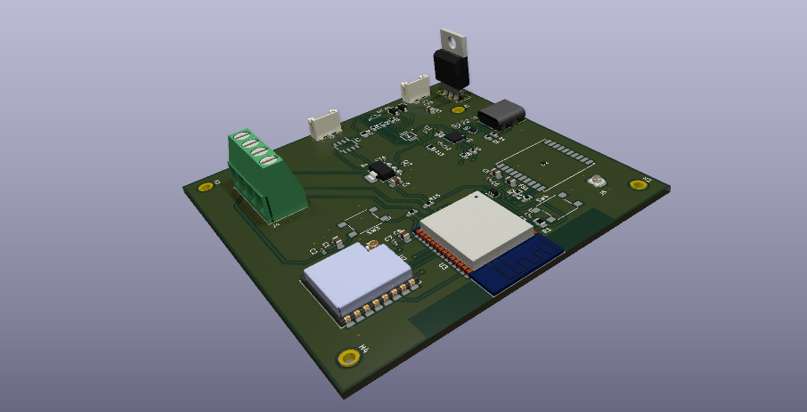

# Remote Plant Monitoring System

## Overview
The Remote Plant Monitoring System is designed to monitor the environmental conditions of plants remotely. It collects real-time data on temperature, humidity, and GPS location, and transmits this data using LoRa (Long Range) communication.

The system uses the ESP32 microcontroller, interfacing with the AM2315C I2C Temperature/Humidity Sensor, MTK3339 GPS Module, and RA-02 LoRa Module. This system is suitable for agricultural applications, where remote monitoring is essential to ensure optimal plant conditions.

## Features
- Temperature and Humidity Monitoring: Uses the AM2315C I2C sensor to measure temperature and humidity in the plant's environment.
- GPS Location: The MTK3339 GPS Module provides GPS coordinates, allowing for the tracking of plant location.
- Long-range Communication: The RA-02 LoRa Module enables communication over long distances (up to several kilometers), sending data to a base station or server.
- Low Power Consumption: Powered by a battery circuit, the system is designed for low power operation with deep sleep functionality for extended use in the field.
- Wireless Data Transmission: All data is transmitted wirelessly, making the system ideal for remote or hard-to-reach locations.
## Components Used
- ESP32-WROOM-32 Microcontroller: A versatile microcontroller with Wi-Fi and Bluetooth capabilities, acting as the central control unit.
- AM2315C Temperature/Humidity Sensor: An I2C-based sensor that measures temperature and humidity in the surrounding environment.
- MTK3339 GPS Module: A GPS module for acquiring the geographical location (latitude and longitude) of the monitoring system.
- RA-02 LoRa Module: A long-range wireless communication module using LoRaWAN technology, transmitting sensor data over great distances.

- Battery Circuit: A power supply system to power the entire setup, including charging and voltage regulation.

## Installation
### Software Setup

Install Libraries:

- AM2315C Sensor: Install the Adafruit AHTx0 Library.
- GPS Module: Install TinyGPSPlus Library.
- LoRa Communication: Install the LoRa library.
In Arduino IDE, go to Sketch > Include Library > Manage Libraries and search for the necessary libraries to install.

## Usage
The ESP32 will initialize the sensor and GPS module.
The system will periodically collect humidity, and GPS coordinates data from the AM2315C sensor and the MTK3339 GPS module.
The collected data will be transmitted via the RA-02 LoRa Module to a receiver base station or a cloud server.
The data can be visualized or logged at the receiving end, such as an ESP32 with LoRa module or a cloud-based platform.
- Power Management
The system is designed to run on a solar cell and battery ,and uses deep sleep modes on the ESP32 to reduce power consumption during idle periods.

## Contributing
Feel free to fork this project and contribute to improvements or bug fixes. If you have suggestions or questions, open an issue on the repository.
